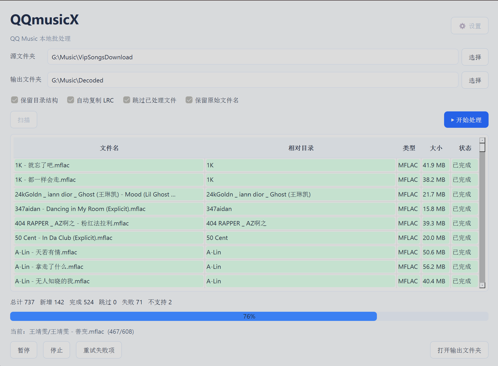

<p align="center"></p>

<h1 align="center">QQmusicX</h1>

<p align="center"><strong>Windows x64 local music batch processor</strong></p>

<p align="center"><a href="README.md">中文说明</a></p>

<p align="center"></p>

**A Windows x64 desktop interface for organizing and batch-processing local QQ Music files with the separately installed `qmdec` command-line tool.**

QQmusicX recursively scans a source tree, preserves relative folders and filenames, copies matching LRC files byte-for-byte, validates output audio with `ffprobe`, and tracks work in SQLite so completed items can be skipped on later runs. Source files are treated as read-only.

> Use only with files and accounts you are authorized to access. QQmusicX does not include or reimplement `qmdec` or its file-processing algorithms. QQ Music and `qmdec` are third-party projects and are not affiliated with this project.

## Downloads

Download the latest release from the [GitHub Releases page](https://github.com/mondeharuo/QQmusicX/releases):

- **`QQmusicX-windows-x64-vX.Y.Z.zip`** — portable folder; extract the full archive and run `QQmusicX.exe`.
- **`QQmusicX-Setup-x64-vX.Y.Z.exe`** — per-user Windows installer; no administrator prompt is required.

The application is built for 64-bit Windows. It is not signed with a commercial code-signing certificate, so Windows SmartScreen may show its standard first-run warning.

## Requirements

- Windows 10 or later, x64
- `qmdec` installed and configured separately. Follow its official instructions: <https://github.com/Sophomoresty/qmdec>
- `ffprobe.exe` from FFmpeg. QQmusicX checks `PATH` and common WinGet locations; if it cannot find `ffprobe`, choose it in **Settings**.

QQmusicX never asks you to send account credentials to this project. Any authentication needed by `qmdec` is handled by that separate program on your own computer.

## Quick start

1. Install the prerequisites above.
2. Extract the ZIP or run the installer.
3. Open QQmusicX and confirm the source and output folders.
4. Click **Scan** and review the discovered items.
5. Click **Start Processing** when ready.

Default folders are `G:\Music\VipSongsDownload` and `G:\Music\Decoded`. Settings are saved per Windows user. The local processing database and rotating logs are kept beside the app in `data` and `logs`.

## Safety and behavior

- Source folders are read-only; all generated audio and copied lyrics go to the output folder.
- Relative folder structure and audio basenames are preserved; only the output audio extension changes to match the generated format.
- Existing valid output is not overwritten.
- LRC files are copied without text decoding or modification.
- SQLite records make repeated scans incremental. The database is local to this PC.
- Audio output is checked with `ffprobe` before it is recorded as successful.

## Build from source

Use Python 3.10 or newer (64-bit recommended):

```powershell
python -m venv .venv
.\.venv\Scripts\python.exe -m pip install -r requirements.txt
.\build.bat
```

To build both distribution formats, install Inno Setup 6 and run:

```powershell
Set-ExecutionPolicy -Scope Process Bypass
.\build_release.ps1
```

The script writes the portable ZIP and installer to `release`. It does not include local databases, logs, song files, `qmdec`, or FFmpeg.

## Project status

This is an early release. The GUI has been checked on Windows x64 with a small local integration sample, Unicode paths, LRC copying, output validation, and repeat-scan behavior. Please report reproducible issues with the application version and a sanitized error message; do not attach encrypted songs, cookies, tokens, or account credentials.

## License

No license has been selected for QQmusicX yet. Until a license is added, the source is publicly viewable but reuse and redistribution are not granted. See `THIRD_PARTY_NOTICES.md` for the licenses of bundled dependencies.
